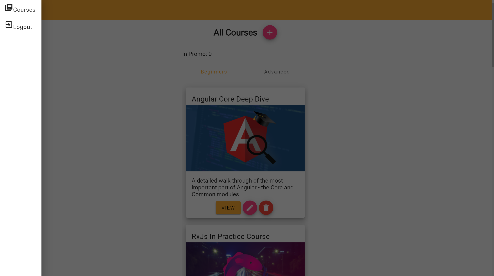

## The challenge
undersatnd and use ngrx to optimize the existing project

## Links
## Ngrx (with NgRx Data) - The Complete Guide

This repository contains the code of the video course [Ngrx (with NgRx Data) - The Complete Guide](https://angular-university.io/course/ngrx-course).
reference repo  git clone https://github.com/angular-university/angular-ngrx-course.git

## Built with

- Semantic HTML5 markup
- CSS  
- Angular +2
- Angular Material
- ngrx
# To Run the Development Backend Server

We can start the sample application backend with the following command:

    npm run server

This is a small Node REST API server.

# To run the Development UI Server

To run the frontend part of our code, we will use the Angular CLI:

    npm start 

The application is visible at port 4200: [http://localhost:4200](http://localhost:4200)

